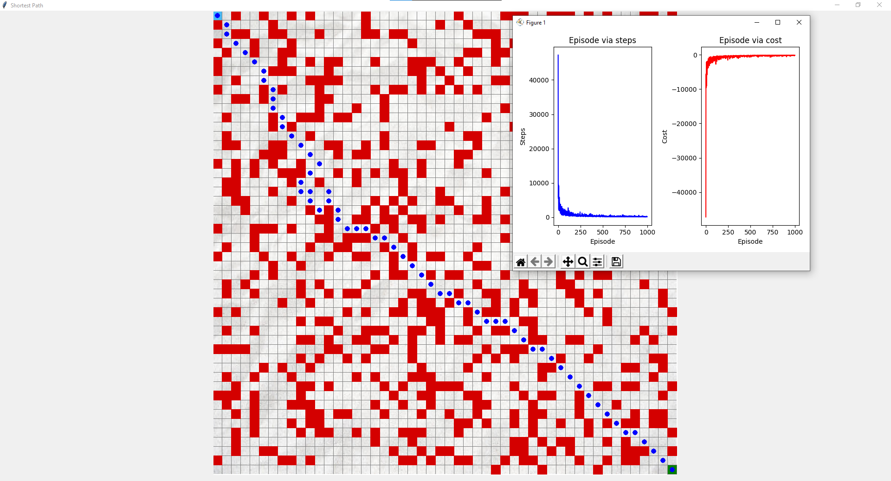

# Q-learning-maze-solver
Q-learning-maze-solver

# Abstract
- In this project, we were asked to find a path in
the maze with the Q-Learning Algorithm. a kind of artificial
intelligence algorithm. In a separate folder for the project, input
and output files for labyrinths in txt format are given. In
addition to these, a pdf is given according to the inpt in the txt
for the display of the maze. According to the inputs, the R
matrix called the gain matrix is ormed. The rows and columns
of this matrix represent the environments, the value of R [i] [j]
is the instantaneous gain value obtained when transitioning
from state i to state j. Gain values can be -1, 0 and 100. It will be
explained in detail later. The output shows the q matrix. The
algorithm starts learning from a random situation in each
iteration. It changes state with respect to A and updates the Q
matrix. The iteration ends when the target state according to A
is reached. Thus, it is aimed to learn machine using the Q
learning algorithm.

- Bu projede bizden istenilen bir tür yapay zeka
algoritması olan Q-Learning Algoritması ile labirentte yol
bulunması istenmiştir. Proje için ayrı bir klasörde labirentler
için txt formatında input ve output dosyaları verilmiştir.
Bunların yanında labirentin gösterimi için txtlerin içindeki
inputa göre pdf verilmiştir. İnputlara göre kazanç matrisi adı
verilen R matrisi oluşturulmaktadır. Bu matrisin satır ve
sütünları ortamları temsil etmektedir, R[i][j] değeri ise i
durumundan j durumuna geçildiğinde elde edilen anlık kazanç
değeridir. Kazanç değerleri -1, 0 ve 100 olabilmektedir. Daha
sonra detaylı bir şekilde anlatılacaktır. Çıktıyı ise q matrisi
göstermektedir. Algoritma her iterasyonda rastgele bir
durumdan öğrenmeye başlar. A'ya göre durum değiştirir ve Q
matrisini günceller. A'ya göre hedef duruma ulaşıldığında
iterasyon sona ermektedir. Böylece Q learning algoritması
kullanılarak makine öğrenilmesi amaçlanmıştır.

# Dependencies
- numpy , tkinter, PIL, matplotlib

# Configure.py
- You can modify in this project ,parameters of q learning algorithm , labirent size and so on ...

# Obstacle.txt
- You can see all this maze's info of square
- (X,Y,square categories)
- categories of square : O(ostacle), R(road), T(target), S(start) 

# Launch Project
- python starter.py

# Screenshot of Shortest Path 
- start point : (0,0)
- end point : (49,49)

# Developers 
Berkay Efe Özcan
Cumali Toprak